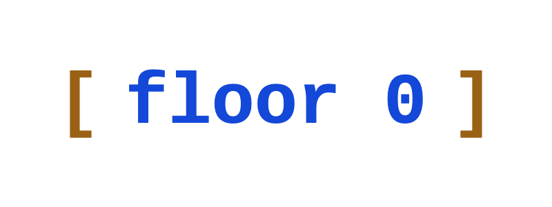

We help you turn your fast-built, AI-assisted MVP into a reliable product that won’t collapse as you grow.

[book a call](https://calendar.app.google/G2Yj1cujj1JAJx6N9)

## Is This You?

**You're doing great**. Users love your product, your company keeps growing, and
you've got funding to take it to the next level.

But you can feel that **your foundations are wobbly**. Adding features takes
longer and longer, and bugs keep coming back.

You also worry: is the product secure? Can it scale? Will your hosting costs
balloon?

Your coding agent tells you everything is covered, but can you trust it?

## Then We Can Help

We audit your systems, locate the structural fractures, and rebuild them while
you keep moving.

**Our goal is to give your product a solid foundation**, so you can continue
growing it without slowing down and without worrying about it collapsing.

## Who We Are

We're a small engineering team, each with more than 15 years of experience,
during which we've seen it all. We've helped startups build up their stacks from
scratch, and we've worked on systems that serve millions of users every day.

Every company is different, and we adapt to their peculiarities, though our work
is always guided by a handful of principles.

## Our Approach

**All good software has warts**. Bad code, tech debt, bugs... They are
unavoidable when building a large and complex product that solves real problems.

In our experience, however, there are a few load-bearing aspects that make a
codebase **resilient to these defects**. It's like the old story of warplanes:
reinforce the critical parts, and you can brush off a few bullet holes here and
there:

1. **Domain Model**: The conceptual representation of your business. This is the
   part that coding agents most often neglect. A strong model makes new features
   feel like natural extensions, not ill-fitting patches.
2. **Architecture**: How the software is organized: the parts it's divided into,
   and the responsibilities of each part. Without it, a change to the checkout
   flow unexpectedly breaks the user profile page.
3. **Setup and Deployment**: The set of tools and practices used to build your
   product and ship it to your users. It's essential for AI-assisted
   development, as it gives agents the strict guardrails they need to self-check
   and self-evaluate.
4. **Observability**: CCTV for your software. Things break, and good
   observability is the difference between pinpointing the exact cause in
   minutes or finding out hours later from an angry tweet.

## How We Work

We're allergic to bureaucracy and process, so we make working with us dead
simple:

1. [You book a free introductory call](https://calendar.app.google/G2Yj1cujj1JAJx6N9),
   where you tell us about your company, your product, and your perceived needs.
2. We send you an offer for an initial audit, where we comb through your
   codebase and your systems to identify which parts need TLC. This takes one to
   five days, priced as a flat fee **between $1,200 and $6,000** depending on
   the size and complexity of your product.
3. The audit report comes in, with a follow-up offer to fix the parts where our
   solution fits. Pricing for development work is **$1,000/day**, with discounts
   for long commitments.
4. We fix things up, while you keep on building your product.

Ready to reinforce your foundation?\
[Let's talk!](https://calendar.app.google/G2Yj1cujj1JAJx6N9)
